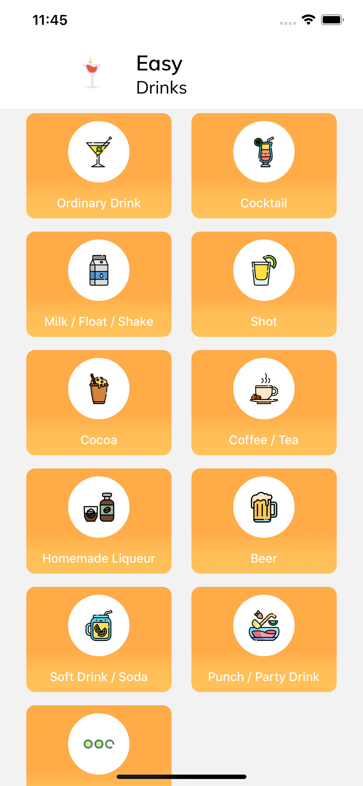

# EZDrinks



Application made using the React Native framework, it is a recipe guide for the most diverse types of drinks.
It uses cocktail recipes from https://www.thecocktaildb.com/

### Run this project 

```sh
yarn install
```

if you want to run the application on an iphone it will be necessary to run the `pod install` command in the ./ios folder before running the following command.

```sh
react-native run-ios or react-native run-android
```
 